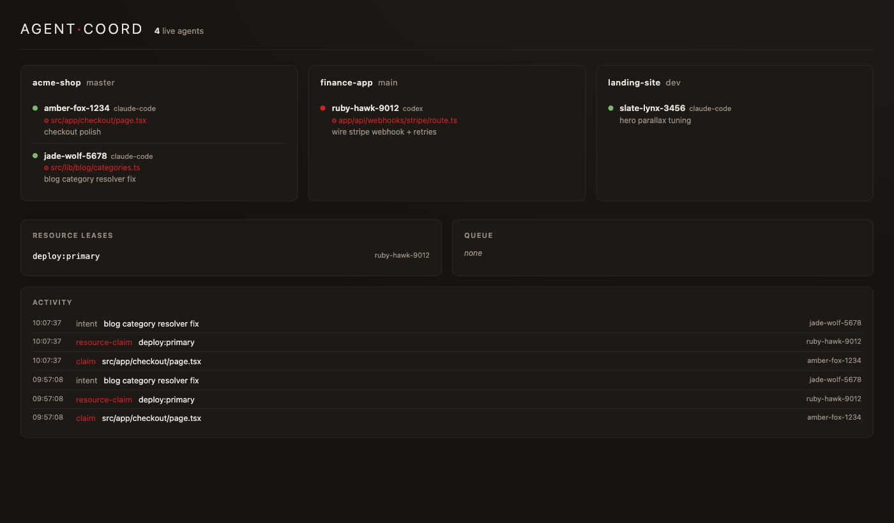
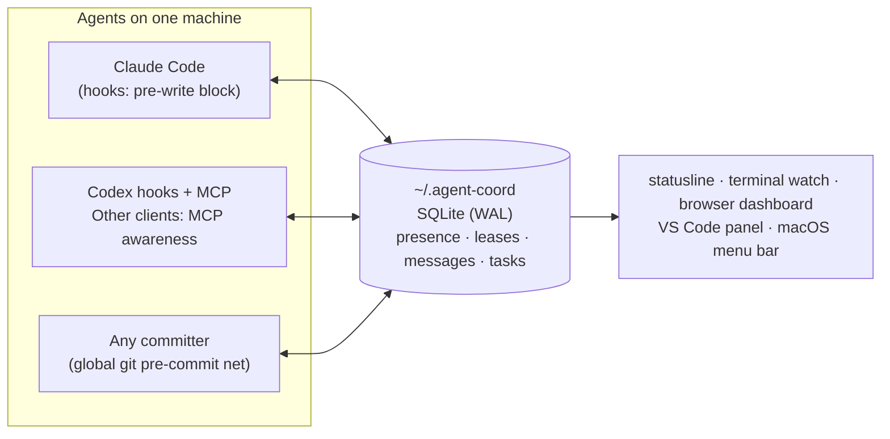

# agent-coord

[](https://github.com/v2matosevic/agent-coord/actions/workflows/ci.yml)
[](./LICENSE)
[](https://nodejs.org)


**A machine-wide coordination layer so multiple AI coding agents running at once
don't step on each other.** Shared presence, file locks, a universal git commit
guard, agent-to-agent messaging, and duplicate-work detection — across every
terminal, window, and repo on your machine.



Built on Node's built-in `node:sqlite` (WAL). The hooks and CLI are **zero-dependency**;
only the MCP server pulls one package (`@modelcontextprotocol/sdk`). No native
build, no daemon, no SPOF — it fails *open but loud*, so a glitch never freezes
your work.

---

## Why

Every AI coding agent is an island: a Claude Code session, a Codex session, and a
Cursor agent each see only their own context and their own working tree. Run a few
at once on one repo — or sharing one dev port / DB / deploy — and they edit the
same file simultaneously, duplicate each other's work, make contradictory
decisions, and collide on shared singletons. That's a distributed-systems failure
with **no coordination primitive**. This adds one.

---

## Install

### Option A — let your coding agent do it (recommended)

Clone the repo, open it in your agent (Claude Code, Codex, Cursor, …), and paste:

> **Read `AGENTS.md` in this repo and set up agent-coord for me: install it, run
> the health check, and tell me what's live and what I need to do next.**

The agent follows the [`AGENTS.md`](./AGENTS.md) runbook — installs, verifies
(`doctor` 10/10), and reports back. Codex hook trust is a separate step below.

```bash
git clone https://github.com/v2matosevic/agent-coord.git
cd agent-coord
# then open this folder in your agent and paste the message above
```

### Option B — one command yourself

```bash
node setup.mjs        # any OS — Windows / macOS / Linux
```
or, on Windows (also builds the VS Code Fleet panel):
```powershell
./setup.ps1
```

Both are **idempotent** (safe to re-run) and **fail-soft** (skip a step if a CLI
isn't installed). They wire Claude and Codex hooks, Claude's statusline, the global git
pre-commit net, and the MCP server into Claude and Codex, then run the health
check. **Requires Node ≥ 22.** Open new agent sessions afterward to pick it up.
In Codex, review/trust the new hooks in `/hooks`. Until trusted, use MCP claims
and message polling. See [Codex integration](./docs/CODEX.md).

Verify any time:
```bash
node cli/doctor.mjs        # expect: 10/10 configuration checks passed
```

---

## What you get

| Agent | What it gets |
|---|---|
| **Claude Code** | Full enforcement — a `PreToolUse` hook claims the file you're about to edit or **blocks it (`exit 2`)** if a peer holds it. Bash guard reserves dev port / DB / deploy. Statusline shows the fleet **and your own identity**. MCP tools for active coordination. |
| **Codex** | Trusted native hooks claim all patch paths, guard recognized shell writes/resources, and deliver peer messages between local tool calls. Hooks and MCP share session identity. Without hooks, use MCP claims and polling plus the commit guard. |
| **Any committer** (Codex / Cursor / Aider / manual) | The **global git pre-commit** rejects a commit that stages a file another live agent is actively editing. |

### How it works



No daemon — every hook, CLI, and MCP call opens the same SQLite store directly
(WAL, `BEGIN IMMEDIATE` for atomic claims) and exits. If anything breaks, the
guards fail **open but loud**: you lose coordination, never your work.

### The coordination model

- **Rooms & resources.** A *room* = a repo (branch-independent), the unit of file
  conflict. *Resources* = shared singletons. A real OS singleton like a TCP
  `port:3000` is **machine-wide** (two repos on one port collide regardless of
  project); a per-project one like a deploy is keyed to the **workspace**
  (`deploy:<ws>`), so an unrelated repo's deploy can't block yours.
- **Self-healing locks (warm/cold).** A file lock only blocks while it's *warm* —
  the holder edited that file in the last few minutes. Once they move on it goes
  *cold* and a waiting agent takes it **automatically** — no force-release, no
  asking the human to unlock. Active concurrent edits still block.
- **Talk that reaches heads-down agents.** Agents leave each other messages
  (`post_message`, workspace-scoped). Unread messages surface not just at the next
  prompt but **between tool calls**, so a peer can reach an agent mid-build.
- **Shared task board.** Agents `claim_task` discrete units of work (atomic — one
  winner under a race), so a peer simply *sees* a task is taken instead of two
  agents building the same thing. Title dedup, dead-owner auto-reclaim, and a
  `depends_on` list that marks tasks blocked/ready. `node cli/tasks.mjs` shows it.
- **Duplicate-work de-confliction.** Beyond the board, `announce_intent` warns the
  later starter that a peer is already on similar work (text-similarity). The
  deterministic tiebreaker (who started first) decides who yields; the later
  starter is advised, then auto-blocked if it keeps duplicating. Ask a peer to
  stand down with `request_yield` instead of fighting locks.
- **One identity per session.** Each agent is a single, stable identity across its
  hooks and its MCP tools — so locks, messages, and commit provenance all line up
  (no ghost twins, and the statusline tells you which terminal is which agent).
- **Autonomous push hand-off.** Told to push a history with other agents' commits,
  an agent runs `pending_push_review` (author + live status + verdict per commit)
  instead of asking you.
- **Decisions stay decided.** `record_decision` pins a project-level choice
  ("httpOnly JWT cookies, no localStorage") — broadcast to live peers, shown to
  every arriving agent, latest-per-topic. The failure it kills: two agents making
  contradictory architectural choices in *different* files, which no file lock
  can see.
- **Searchable memory.** Everything above accumulates into the store, and
  `search` (FTS5 full-text) answers "has this been discussed / decided / built
  already?" across messages, decisions, tasks, and issues — best match first,
  not just chronological dumps.
- **One-call check-in, token-frugal by design.** The coordination layer writes
  INTO model context, so its own chattiness is a cost every agent pays.
  `announce_intent` returns the whole arrival brief (your identity, live peers +
  their tasks, the board, standing decisions, unread mail) — one call instead of
  a `whoami`/`list_active_agents`/`list_tasks` round, and the only arrival
  channel a hookless agent (Codex) has. Every list an agent ingests is capped
  but **lossless and loud**: message backlogs drain in batches with an exact
  `remaining` count (a directed message stuck behind broadcasts is flagged
  urgently), and truncation always says so — a partial dump never reads as
  "that was everything".
- **Hooks fast enough to forget.** They run on every tool call, so they're
  measured, not guessed: repo root + branch resolved by filesystem instead of
  `git rev-parse` spawns (subprocess fallback for exotic layouts), liveness
  writes throttled through a local marker, and no write lock taken to discover
  an empty mailbox. ~38ms per event on macOS against a ~30ms node-boot floor.

---

## Commands

```bash
node cli/doctor.mjs                 # 9-point health check
node cli/status.mjs                 # one-shot fleet table
node cli/watch.mjs                  # live fleet in the terminal (2s)
node cli/dashboard.mjs [port]       # live browser dashboard (default :7777)
node cli/tasks.mjs                  # shared task board (--add "title" | --done <id>)
node cli/worktree.mjs new           # isolate an agent: own worktree + branch + port
node cli/insights.mjs [--since 7d]  # retro: files edited by 2+ agents + conflicts
node cli/digest.mjs [--since 7d]    # write a durable per-project hotspot digest (~/.agent-coord/digests/)
node cli/pending-push.mjs           # who authored the unpushed commits + push verdicts
node cli/search.mjs "<query>"       # full-text search messages/decisions/tasks/issues (--kinds, --limit)
node cli/release.mjs --file <p> | --resource <id> | --agent <id> | --all
```
All CLIs run under `node --disable-warning=ExperimentalWarning <script>`.

## MCP tools (Claude + Codex)

`whoami`, `announce_intent`, `list_active_agents`, `get_global_state`,
`check_conflicts`, `claim_files`, `release_files`, `claim_resource`,
`release_resource`, `log_activity`, `post_message`, `read_messages`,
`pending_push_review`, `ask_agent`, `check_replies`, `reply`, `request_yield`,
`query_history`, `list_tasks`, `claim_task`, `claim_next_task`, `update_task`,
`record_decision`, `list_decisions`, `search`, `report_issue`, `list_issues`,
`resolve_issue`.

## Issue log — "come back later and fix it" (cross-project)

The coordination tables above are workspace-scoped and short-lived — built for
agents working *together* right now. The **issue log** is the opposite: a durable,
**cross-project** backlog of problems worth fixing later. An agent that hits a real
bug, a recurring friction, a broken build, or a coordination failure — in *any*
repo — files it with `report_issue` (auto-tagged with the project, agent, branch,
and area). The operator surveys the whole machine's backlog from one place and
fixes them on their own time, so a future "fix this" starts with full context
instead of from zero.

```bash
node cli/issues.mjs                       # open issues across ALL projects (grouped)
node cli/issues.mjs --here                # only the current repo
node cli/issues.mjs i-1a2b3c4d            # full context of one issue
node cli/issues.mjs --resolve <id> "how it was fixed"
node cli/issues.mjs --export              # mirror to ~/.agent-coord/issues/*.md
```

Issues are also indexed by `search` (so "has this come up before?" finds them) and
this repo's open count shows in every agent's session brief. Stored in the global
SQLite store and (on `--export`) mirrored to `~/.agent-coord/issues/` — outside any
repo, so client context never leaks into a public push. Machine-local for now.

## VS Code extension (optional)

An Activity Bar **Fleet** panel — every agent across every repo (who, file held,
leases, queue, activity) + an "Open in Tab" view. `setup.ps1` builds and installs
it; see [`vscode-extension/README.md`](./vscode-extension/README.md). It reads the
store via your system `node` (no extension dependencies).

## macOS menu bar (optional)

The Mac-native counterpart to the VS Code panel: a **SwiftBar/xbar plugin** that
lives in the menu bar showing the live fleet — agent count (🟢 / 🔴 when files are
contended / ⚠️ when degraded), a dropdown of agents grouped by repo with the file
each holds, contended files, resource leases, the task board, and a link to the
dashboard. `node setup.mjs` generates it on macOS; or run it directly:

```bash
node cli/install-macos-menubar.mjs   # generates the plugin + installs it if SwiftBar/xbar is found
```

Needs [SwiftBar](https://swiftbar.app) (`brew install --cask swiftbar`) or xbar.
The plugin is read-only and resolves `node` itself (GUI apps don't inherit your
fnm/Homebrew PATH), so it works regardless of how Node is installed.

## Desktop notifications (macOS)

Native banners when you're **blocked** on a file, a **peer messages** you, or asks
you to **yield** — so a heads-down *human* hears what the system already tells
heads-down *agents*. On by default on macOS (`AGENT_COORD_NOTIFY=0` mutes, `=1`
forces on); uses `terminal-notifier` if installed, else the built-in `osascript`.
Fired from the hooks, non-blocking and fail-safe, with same-event alerts deduped
within a short window so a retried edit never spams.

## Tests

```bash
npm test                          # full suite, each test in an isolated throwaway store
node test/run-all.mjs messages    # filter by name
```

CI runs the suite on Windows, macOS, and Linux (Node 22 + 24) on every push and PR.

## Uninstall

```bash
git config --global --unset core.hooksPath   # prior value in ~/.agent-coord/git-hookspath.prior
claude mcp remove agent-coord --scope user
codex mcp remove agent-coord
# restore a ~/.claude/settings.json.bak.*  and delete ~/.agent-coord/
```

## How it compares

Most multi-agent tooling solves concurrency by **isolation**: a git worktree or
container per agent (claude-squad, container-use, vibe-kanban, ccmanager…).
That works — until the agents are supposed to be working on the *same* tree, or
they share a dev port, a database, a deploy target. The few projects that do
shared-tree coordination (mcp_agent_mail, swarm-protocol) keep their file
leases **advisory**: the agent is *asked* to check before writing.

agent-coord's stance is **enforcement at the chokepoints**: the `PreToolUse`
hook *blocks* the write (exit 2) while a peer's lease is warm, risky shell
commands claim shared resources (a machine-wide port, a per-repo deploy) before
they run, and the git
pre-commit/pre-push hooks catch every committer — including agents with no
hook support at all. Awareness (presence, messages, board, decisions, search)
rides on top of that floor, and the locks self-heal so enforcement never needs
a human with a key. Isolation tools and agent-coord compose, by the way: a
worktree-per-agent setup still shares ports, DBs, and pushes.

## Honest limits

Coordination is advisory-by-default; the **hard** blocks are Claude Code or trusted Codex
`PreToolUse` (pre-write) and the git pre-commit hook (at commit, every committer).
Clients without native hooks get awareness via MCP and the commit net. Codex
hooks do not cover hosted tools or arbitrary scripts; shell parsing is heuristic.
Locks are whole-file. A single-user machine is assumed — there's no auth boundary
in the store. See [`DESIGN.md` §9](./DESIGN.md) for the full list.

## Docs

- [`AGENTS.md`](./AGENTS.md) — install/operation runbook for AI agents.
- [`docs/SYSTEM.md`](./docs/SYSTEM.md) — complete as-built reference.
- [`docs/AGENT-PROTOCOL.md`](./docs/AGENT-PROTOCOL.md) — how agents should coordinate.
- [`DESIGN.md`](./DESIGN.md) — original architecture & rationale.
- [`docs/FUTURE.md`](./docs/FUTURE.md) — roadmap beyond the macOS expansion.
- [`CHANGELOG.md`](./CHANGELOG.md) — what's been built.
- [`docs/LIVE-TEST.md`](./docs/LIVE-TEST.md) — first live two-agent validation.

## Contributing & security

PRs welcome — read [`CONTRIBUTING.md`](./CONTRIBUTING.md) first (zero-dependency
rule, fail-open invariant, test expectations). Security model and how to report
a vulnerability: [`SECURITY.md`](./SECURITY.md). Licensed [MIT](./LICENSE).

---

Platform: developed on **Windows 11 + PowerShell 7** and also installed & proven on
**macOS (Apple Silicon)** — both with Claude Code and Codex. The core (Node +
`node:sqlite` + the hooks/MCP/CLI) is portable; `node setup.mjs` runs on
Windows/macOS/Linux (doctor 9/9, suite 17/17 on macOS). The few Windows-specific
runtime paths branch on `process.platform`, so each OS keeps its native behaviour.
Single-user machine by design.
